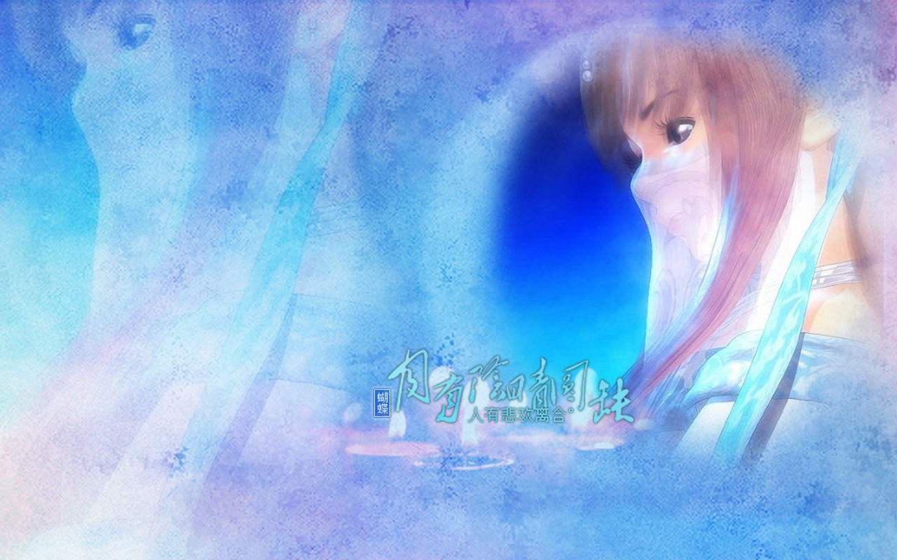

# There is something in nothing.
<p align='center'>

</p>

## 2019-12-10

* 游戏派单厅
```
Hall {
    name
    title
    homeowner(User) //用户类型
    category(Category) //房间类型
    
}
```
* 用户
```
User {

}
```

* 类型
```
Category {

}
```

## 2018-06-03
  * 添加了cocos2dx-lua配置工程；
  * 可以在swift工程中做lua小游戏了；
  * 请参见：[CocosLua工程说明](https://github.com/usiege/CocosLua)

## 2018-05-17
  * 添加了一个转圈圈的效果；
  * 添加了日期判断，必须是当天才能玩哦；

## 2018-05-16
  * 函数链结构可以使用啦；
  * 添加了一个圈圈；

## 2018-04-26
  * 第一次添加了一个点击效果；
  * 写了一个函数链的结构；
